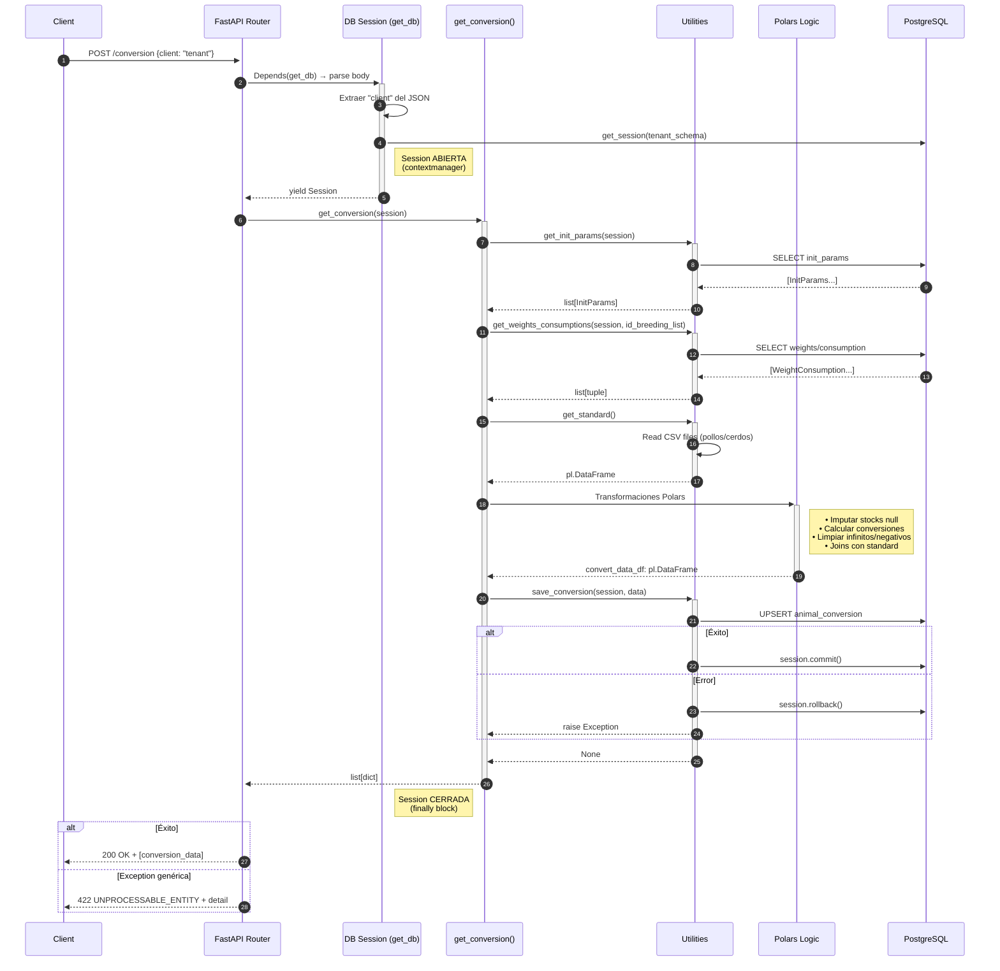

# Auditoría "Last Mile" - Microservicio KPI Conversion

> **Fecha:** 2025-12-09  
> **Objetivo:** Validar robustez, flujo y manejo de errores antes de producción.

---

## 1. Diagrama de Secuencia

El siguiente diagrama muestra el flujo completo de un request al endpoint `/conversion`:



---

## 2. Análisis de Puntos Débiles (Code Review)

### 2.1 Router (`conversion.py`)

**Problema:** Catch-all `Exception` enmascara todos los errores como `422 UNPROCESSABLE_ENTITY`.

```python
# Código actual (líneas 16-20)
try:
    result = get_conversion(session)
    return result
except Exception as e:
    raise HTTPException(status_code=status.HTTP_422_UNPROCESSABLE_ENTITY, detail=str(e))
```

**Riesgos identificados:**
| Tipo de Error                | Código Esperado           | Código Actual |
| :--------------------------- | :------------------------ | :------------ |
| Error de validación de datos | 422                       | 422 ✅         |
| Error de conexión a DB       | 503 Service Unavailable   | 422 ❌         |
| Error lógico interno         | 500 Internal Server Error | 422 ❌         |
| TimeoutError                 | 504 Gateway Timeout       | 422 ❌         |

**Cambio sugerido:**

```python
from sqlalchemy.exc import SQLAlchemyError, OperationalError

@conversion_router.post("", status_code=status.HTTP_200_OK)
def calculate_conversion(
    payload: dict = Body(..., example={"client": "tecnoandina"}),
    session: Session = Depends(get_db),
) -> list[dict]:
    try:
        result = get_conversion(session)
        return result
    except OperationalError as e:
        raise HTTPException(
            status_code=status.HTTP_503_SERVICE_UNAVAILABLE,
            detail=f"Database connection error: {str(e)}"
        )
    except SQLAlchemyError as e:
        raise HTTPException(
            status_code=status.HTTP_500_INTERNAL_SERVER_ERROR,
            detail=f"Database error: {str(e)}"
        )
    except ValueError as e:
        raise HTTPException(
            status_code=status.HTTP_422_UNPROCESSABLE_ENTITY,
            detail=f"Data validation error: {str(e)}"
        )
    except Exception as e:
        raise HTTPException(
            status_code=status.HTTP_500_INTERNAL_SERVER_ERROR,
            detail=f"Unexpected error: {str(e)}"
        )
```

---

### 2.2 Servicio (`get_conversion`)

**Flujo analizado:** Lectura → Cálculo → Escritura

**Riesgo de consistencia:** BAJO ✅

```python
# utilities/get_data.py líneas 70-77
def save_conversion(session: Session, data: list[dict]) -> None:
    try:
        session.exec(upsert_animalshed_conversion(data))
        session.commit()
    except Exception as e:
        LOGGER.error(f"Error saving conversion data: {e}")
        session.rollback()  # ← Rollback correcto
        raise
```

El código ya implementa correctamente:
- `session.commit()` solo después del upsert exitoso
- `session.rollback()` en caso de error
- Re-raise de la excepción para propagarla al router

**Observación:** La operación es **idempotente** (usa `ON CONFLICT DO UPDATE`), por lo que reintentos seguros.

---

### 2.3 Casos Borde: Lista Vacía `[]`

**Escenario:** `get_conversion` retorna `[]` cuando no hay datos.

**Verificación del código:**

```python
# services/conversion.py líneas 24-31
if convert_data_df.is_empty():
    LOGGER.warning("No conversion data found for the breeding list. Returning empty result.")
    return []  # ← Early return ANTES de save_conversion

# ...

if init_df.is_empty():
    LOGGER.warning("No initial parameters found. Returning empty result.")
    return []  # ← Early return ANTES de save_conversion
```

**Comportamiento:** ✅ Correcto
- Retorna `[]` con código `200 OK`
- **No** ejecuta `save_conversion` con lista vacía
- Logs de warning adecuados

> [!NOTE]
> Si el frontend espera distinguir "no hay crianzas activas" de "error", considerar retornar un objeto `{ "data": [], "count": 0 }` en lugar de `[]`.

---

### 2.4 Observación Adicional: Payload no utilizado

```python
# Router línea 13
payload: dict = Body(..., example={"client": "tecnoandina"}),
```

El parámetro `payload` se declara pero **nunca se usa** en la función. El `client` se extrae directamente en `get_db`. Esto es funcionalmente correcto pero podría causar confusión.

---

## 3. Veredicto "Production Ready"

| Componente                           | Estado      | Riesgo Detectado                                   | Acción Sugerida                                 |
| :----------------------------------- | :---------- | :------------------------------------------------- | :---------------------------------------------- |
| **Entrypoint** (`main.py`)           | ✅ Limpio    | N/A                                                | N/A                                             |
| **Router** (`conversion.py`)         | ⚠️ Aceptable | Catch-all exception enmascara errores 500 como 422 | Refinar excepciones (DB vs Logic vs Validation) |
| **Servicio** (`get_conversion`)      | ✅ Robusto   | N/A - Maneja casos vacíos correctamente            | N/A                                             |
| **Persistencia** (`save_conversion`) | ✅ Robusto   | N/A - Rollback implementado                        | N/A                                             |
| **Sesión DB** (`get_db`)             | ✅ Robusto   | Cierre garantizado por `contextmanager`            | N/A                                             |
| **Workers/Colas**                    | ✅ N/A       | Flujo completamente síncrono                       | N/A                                             |
| **Payload no usado**                 | ℹ️ Info      | Parámetro declarado sin uso                        | Eliminar o documentar intención                 |

---

## 4. Resumen Ejecutivo

```
┌─────────────────────────────────────────────────────────────────┐
│  VEREDICTO: APTO PARA PRODUCCIÓN (con recomendación menor)    │
└─────────────────────────────────────────────────────────────────┘
```

**Fortalezas:**
- ✅ Flujo completamente autosuficiente (sin workers/colas)
- ✅ Sesión de DB con lifecycle correcto (`contextmanager` + `finally`)
- ✅ Operación de escritura idempotente (upsert)
- ✅ Rollback en caso de error de persistencia
- ✅ Manejo correcto de casos borde (listas vacías)

**Mejora recomendada (prioridad baja):**
- ⚠️ Refinar manejo de excepciones en router para códigos HTTP semánticos

---

*Auditoría realizada por: Arquitecto de Software / Lead MLOps*
